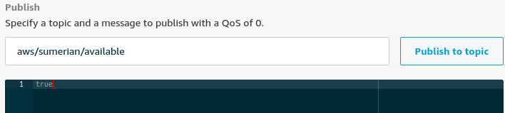

# MQTT protocol with ROS and AWS IoT compatible

This package is an adaptation from [mqtt_bridge repository](https://github.com/groove-x/mqtt_bridge) and uses AWSIoTPythonSDK instead of paho-mqtt.

## Requirements

* AWS account
  * AWS IoT Core project
  * AWS IoT Thing
* Linux 18.04.4 (Bionic Beaver)
* ROS Melodic
* Python 2.7

## Cloning the repository

Do the cloning inside your ROS workspace

    cd ~/catkin_ws/src
    git clone https://github.com/dftossem/mqtt_ros_aws_iot.git

## Install requirements

    cd mqtt_ros_aws_iot
    # Python requirements
    pip install .
    # ROS package requirements
    sudo apt install ros-melodic-rospy-message-converter

## Change connection parameters

In the *config/params.yaml* file change host (endpoint) and certificates. If you have installed the [AWS CLI](https://docs.aws.amazon.com/cli/latest/userguide/install-cliv2.html) then you can find the host variable by typing in a terminal:

    aws iot describe-endpoint --endpoint-type iot:Data-ATS

## Test

### Build the package

Use catkin to build your ROS workspace

    cd ~/catkin_ws
    catkin_make

### Update source

    source ~/catkin_ws/devel/setup.bash

### Launch

    roslaunch mqtt_ros_aws_iot connect.launch

### Verify on AWS IoT Core page

#### Policy

Login to your AWS account and go to the AWS IoT Core page, be sure to have granted the right access. Warning: Code below accept every connection, be sure to change your policy after testing.

```javascript
{
  "Version": "2012-10-17",
  "Statement": [
    {
      "Effect": "Allow",
      "Action": [
        "iot:Publish",
        "iot:Subscribe",
        "iot:Receive",
        "iot:Connect"
      ],
      "Resource": "*"
    }
  ]
}
```

Then, in the **Test** option set *logger/machine* as Subscription topic and click the **Subscribe to topic** button.

### Local topic publish

In a new terminal publish the ROS topic

    rostopic pub -1 /machine/logger std_msgs/String "data: 'Hello world from local'"

You should see the local topic payload data on the AWS IoT page just like this:

```javascript
{
  "data": "Hello world from local"
}
```
### Publish topic from AWS IoT Core

In a new terminal type the next command

    rostopic echo /aws/sumerian/available

Go to the AWS IoT Core page and in the **Test** option click on **Publish to a topic**, set *aws/sumerian/available* write: true and click **Publish to topic**



You should see the response on your local machine just like this:

```
data: True
---
```

